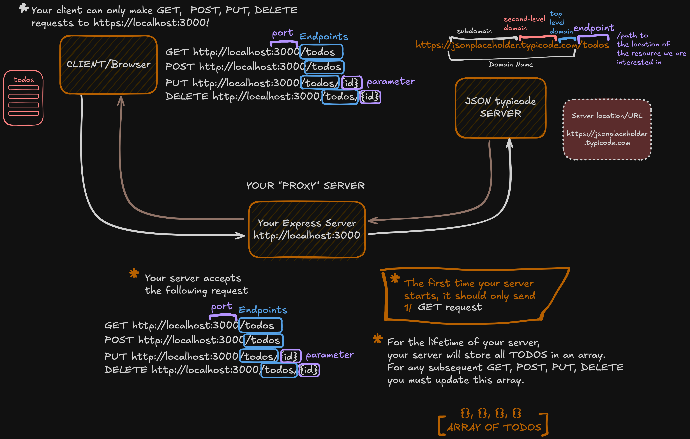
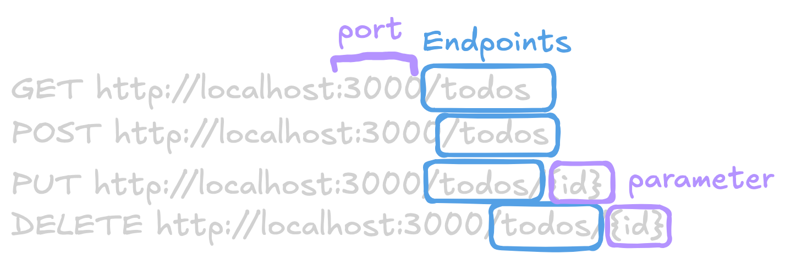
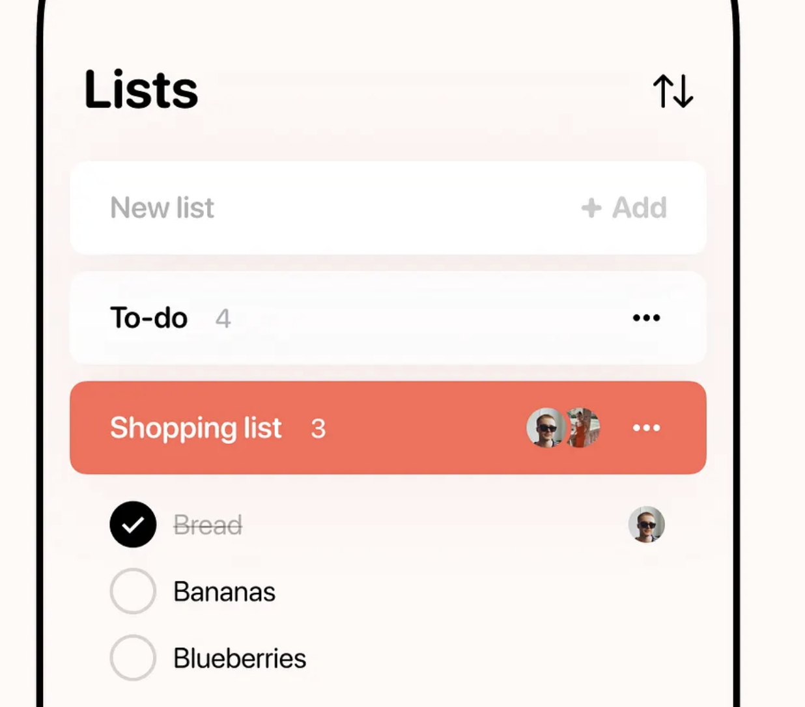

# Creating your first server

This repo serves as a complementary project that helps you to solidify what you reviewed/studies and practiced during last post on #resources. While completing this project, you will

1. Implement a server that:

- Implement/practice GET requests
- Implement/practice POST requests
- Implement/practice PUT requests
- Implement/practice DELETE requests

---

## Overview

In this project, you will:

- **Create an Express server**
- **Create an Express server** that temporarily stores/deletes/updates/adds new data to
  an array (server's memory).

---

## Task Instructions

### 1. Your application has the following requirements

The link to the app diagram is [here](https://excalidraw.com/#json=--_C-3nEzi1tP5cc3i8aV,GN18F-kinWVhCYK7lXO9ZQ)

> [!IMPORTANT]
> The API to get your **todos** is `https://jsonplaceholder.typicode.com/todos`. This request must
> be made by your **_SERVER_** and not your browser.

### 2. Build the Express API

Make sure your Express `API` server can receive the following requests to the following
endpoints:

### 3. Test your API

Before you continue, ensure your API is working. Install [Postman](https://www.postman.com/)
and then test it! Ensure you can get (**GET**) `todos`, add (**POST**) `todos`, update (**_PUT_**) `todos` and delete (**_DELETE_**) `todos`.

### 4. Build a basic frontend

Now, it is time to build the frontend

### 5. Style your app and make it responsive

Here are an idea of what your `frontend` might look like

> [!WARNING]
> You do not need to worry about folder structure for now. Next project we will discuss
> about server folder structure and organization.
